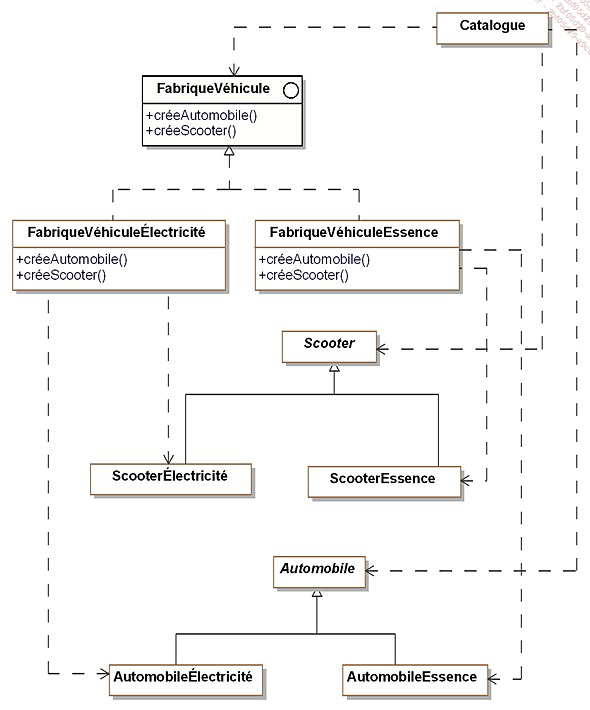

Objectifs : 
 
mettre au point un scenario de creation d'application d'entreprise a faire valider 
Creer une application C# avec le framework .NET ( Web, WebApi ou console)
Decrire des problematiques metiers qui necessite l'usage de design pattern etudie en cours

Contraintes: 
 
Illustrez vos propos avec des exemples de code issus de votre solution.
Utilisez au moins 2 patterns de construction
Utilisez au moins 2 patterns de structuration
Utilisez au moins 1 pattern de comportement

 Consignes supplementaires : 
 
rendre le travail sous forme d'un depot Git documente, accompagne d'un dossier contenant le travail effectue pendant la semaine, ainsi que la prise de note effectuee

Cours Design Pattern C#
Descrition des patterns :
Nom
Description
Exemple de code sous forme de diagrame UML
La structure standard (abstraite)
Un exemple de code
Cas concret d'étude pour ce cours
Nous allons prendre en exemple le cas d'une société qui vend des véhicules en ligne.

Première grande famille de design pattern: Les patterns de construction
Les patterns de construction déterminent comment faire l'instanciation et la configuration des classes et des objets. Ces patterns permettent également d'encapsuler les classes concrètes et de rendre indépendant la façon dont les objets sont créés.

Le pattern Abstract Factory
https://refactoring.guru/fr/design-patterns/abstract-factory

Le pattern Abstract Factory permet, à partir d'une interface, de créer une famille d'objets sans pour autant spécifier de classes concrètes. Pour chaque type d'objet (véhicule ici), nous disposons d'une classe abstraite et de n sous-classes, qui définiront chacune un modèle spécifique. Cela permet de les regrouper en "famille".

L'objet catalogue va prendre obligatoirement une instance FabriqueVéhicule, Scooter, Automobile Scooter, Automobile sont des classe Abstraite, elles en peuvent pas être appeler. Et FabriqueVéhicule est une interface.

public abstract class Scooter
{
  protected string modele;
  protected string couleur;
  protected int puissance;
[...]
Le pattern Builder
https://refactoring.guru/fr/design-patterns/builder

Ce pattern permet d'abstraire la construction d'objet complexes de leur implementation de sorte qu'un client puisse créer des objets complexes sans avoir a se preocuper des differences d'implementation.

image

Pourquoi utiliser ce pattern:

le client a besoin de construire des objets sans connaitre leur implementation
un client a besoin de construire des objets complexes ayant plusieurs representations ou implementations
Le pattern Factory Method
https://refactoring.guru/fr/design-patterns/factory-method

Le but de ce pattern est d'introduire une méthode abstraite de création d'objet en reportant la aux sous-classes concretes la création effective.

image

image image

Le pattern Singleton
https://refactoring.guru/fr/design-patterns/singleton

Il faut s'assurer de deux choses lorsqu'on veut mettre en place ce pattern:

Une classe ne doit posseder qu'une seule instance
Il faut fournir une méthode de classe qui permet de fournir cette instance unique
Le pattern Prototype
https://refactoring.guru/fr/design-patterns/prototype

Le but de ce pattern est de créer de nouveaux objets en dupliquant des objets existants appeles "prototypes". Ce derniers disposent d'une capacité de clonage

image

Introduction des patterns de structuration
L’objectif des patterns de structuration est de faciliter l’indépendance de l’interface d’un objet ou d’un ensemble d’objets vis-à-vis de son implantation. Dans le cas d’un ensemble d’objets, il s’agit aussi de rendre cette interface indépendante de la hiérarchie des classes et de la composition des objets. En fournissant les interfaces, les patterns de structuration encapsulent la composition des objets, augmentant le niveau d’abstraction du système à l’image des patterns de création qui encapsulent la création des objets. Les patterns de structuration mettent en avant les interfaces. L’encapsulation de la composition est réalisée non pas en structurant l’objet lui-même mais en transférant cette structuration à un second objet. Celui-ci est intimement lié au premier objet. Ce transfert de structuration signifie que le premier objet détient l’interface vis-à-vis des clients et gère la relation avec le second objet qui lui gère la composition et n’a aucune interface avec les clients externes.

Le pattern Adapter
https://refactoring.guru/fr/design-patterns/adapter

Le but ici est d'adapter l'interface d'une classe donnee afin qu'elle puissent interagir avec un client

image

Le pattern Decorator
https://refactoring.guru/fr/design-patterns/decorator

Le pattern Decorator est un pattern de structuration qui permet d'ajouter dynamiquement des fonctionnalités à un objet.

Ici, on cherche a ajouter des fonctionnalités suplémentaire a un objet en prenant soin de ne pas modifier son interface. Toutes modifications apportées par ce pattern sereont transparente vis a vis des clients.

Ce pattern constitue une alternative a l'heritage.

image

Le pattern Decorator peut être utilisé dasn les domains suivants:

notre application souhaite ajouter dynamiquement des fonctionnalités à un objet sans modifier son interface, autrement dit sans avoir à modifier les clients de cet objet
une application doit gérer des fonctionnalites qui peuvent être retirées dynamiquement
l'utilisation de l'héritage n'est pas une option car la hhierarchie d'objets est déjà trop complexe.
Le pattern Bridge
https://refactoring.guru/fr/design-patterns/bridge

image image

C'est le principe d'ancapsuler complètement un objet dans un autre objet

Le pattern Composite
https://refactoring.guru/fr/design-patterns/composite

image

Au sein de notre système de vente de véhicules, nous voulons représenter les sociétés clientes, notamment pour connaître le nombre de véhicules dont elles disposent et leur proposer des offres de maintenance de leur parc. Les sociétés qui possèdent des filiales demandent des offres de maintenance qui prennent en compte le parc de véhicules de leurs filiales. Une solution immédiate consiste à traiter différemment les sociétés sans filiale et celles possédant des filiales. Cependant cette différence de traitement entre les deux types de société rend l’application plus complexe et dépendante de la composition interne des sociétés clientes. Le pattern résout ce problème en unifiant l’interface des deux types de sociétés et en utilisant la composition récursive. Cette composition récursive est nécessaire car une société peut posséder des filiales qui possèdent elles-mêmes d’autres filiales.

Les patterns de comportement
TODO: Ajouter la définition des patterns de comportements

image image image